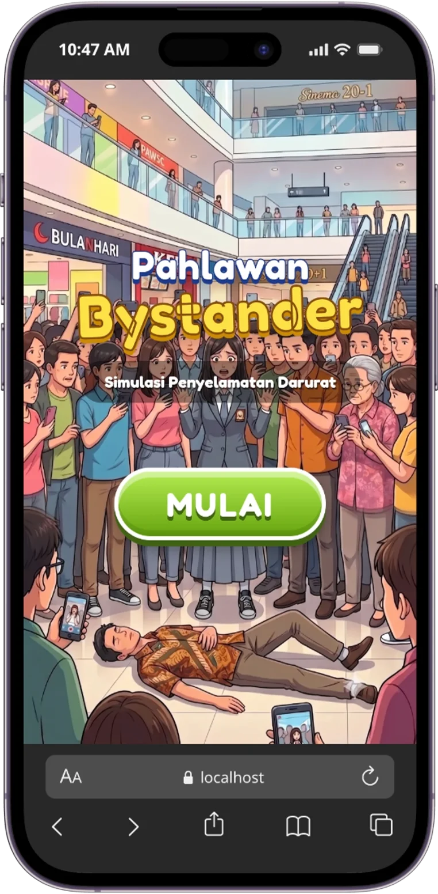
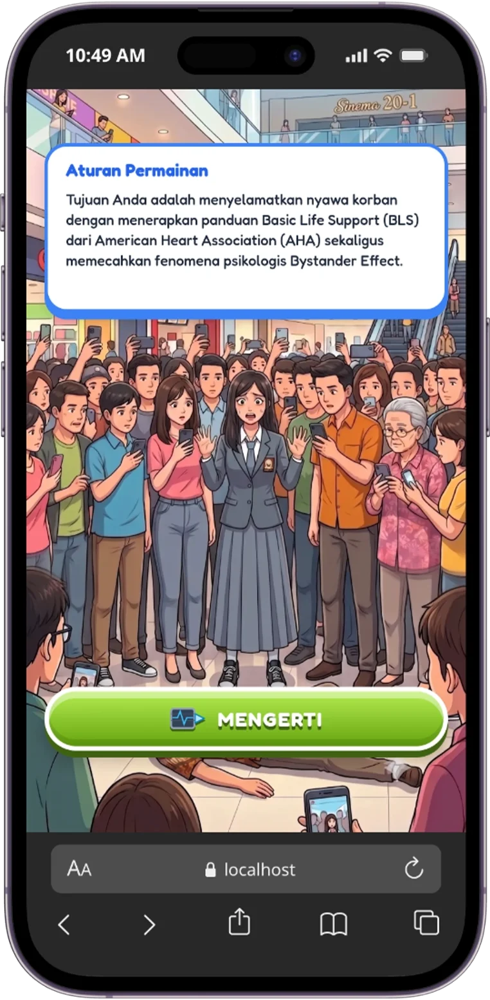
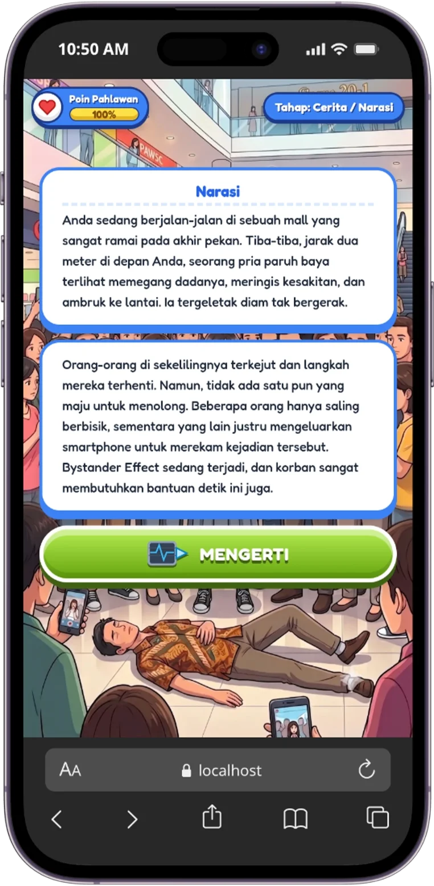
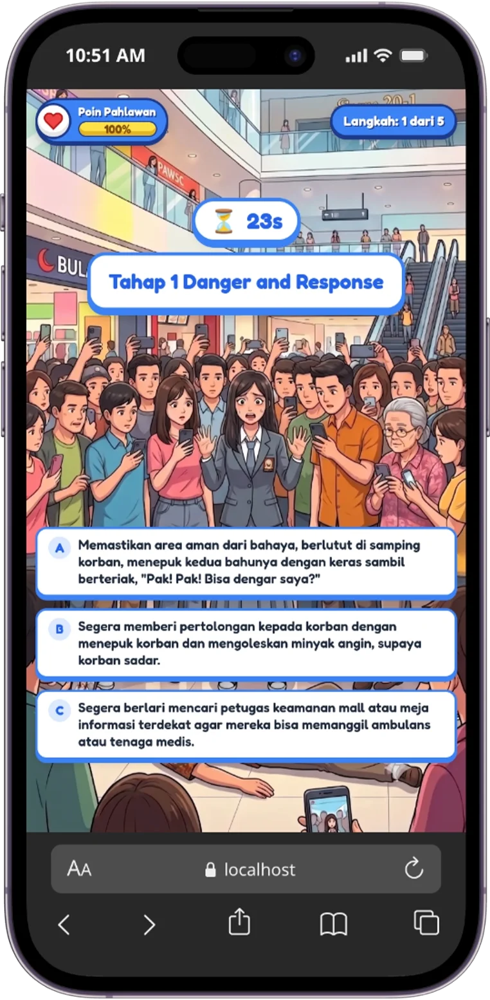
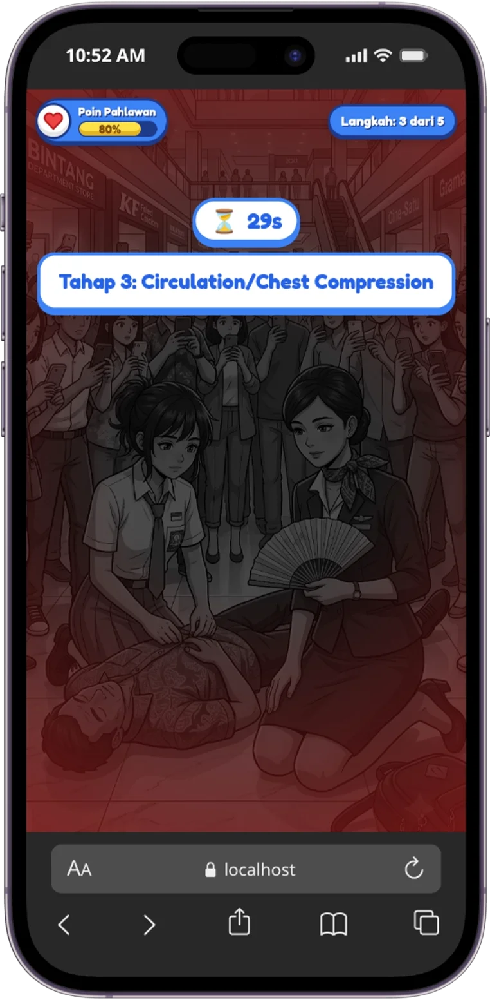
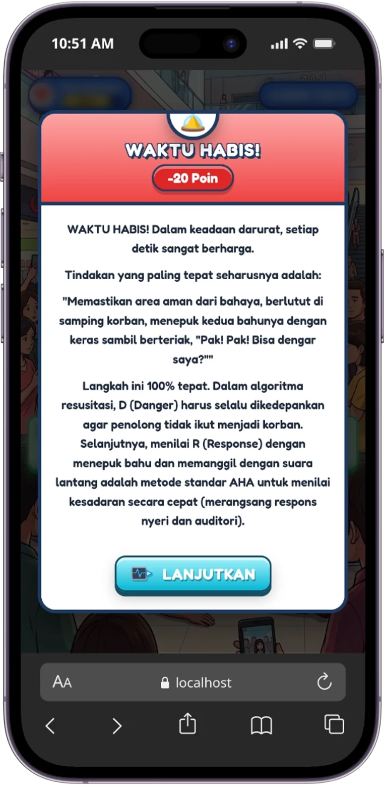
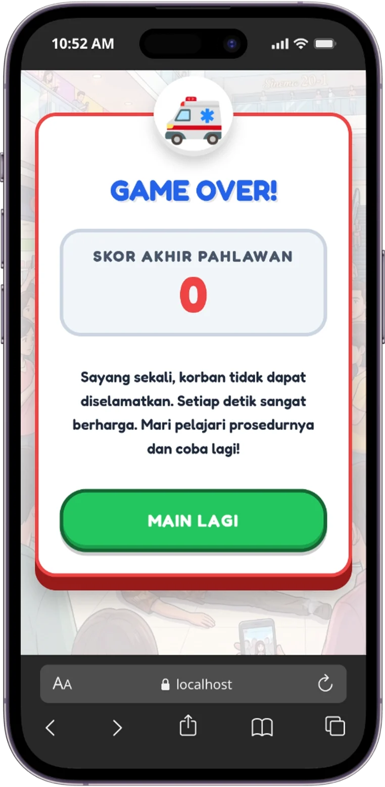

# Pahlawan Bystander

Sebuah permainan naratif interaktif berbasis web yang dibangun dengan Svelte (v4), JavaScript (ES6+), HTML5, CSS3 (Vanilla), Vite, dan Node.js (NPM).

## 🌟 Gambaran Umum

Pahlawan Bystander adalah pengalaman interaktif menarik yang dirancang untuk mengedukasi dan menginspirasi. Dibangun menggunakan teknologi web modern, permainan ini menampilkan penceritaan dinamis, pilihan interaktif, pelacakan skor, dan antarmuka pengguna (UI) yang indah serta disesuaikan untuk perangkat desktop maupun seluler.

## ✨ Fitur

- **Gameplay Naratif Interaktif**: Buat pilihan-pilihan yang akan memengaruhi akhir cerita.
- **Desain Responsif**: Antarmuka indah yang beradaptasi dengan sempurna pada layar Seluler maupun Desktop (Gambar Background masih lebih optimal jika digunakan pada Smartphone).
- **High Performance**: Dibangun menggunakan Svelte untuk pengalaman pengguna yang cepat dan reaktif.
- **Peralatan Modern**: Digerakkan oleh Vite untuk proses pengembangan yang sangat cepat.

## ⚙️ Pengaturan Permainan (Configuration)

Anda dapat mengubah pengaturan dasar permainan secara terpusat tanpa harus membongkar *code* komponen UI. Cukup ubah nilai variabel pada file `src/lib/config.js`:
- `COUNTDOWN_TIMER_SECONDS`: Durasi hitung mundur (dalam detik) yang diberikan kepada pemain di setiap tahapan skenario.
- `TYPING_SPEED_MS`: Kecepatan efek teks mengetik (dalam milidetik per huruf). Semakin kecil angkanya, teks akan muncul semakin cepat (rekomendasi: 30 - 80).

## 🚀 Memulai

### Prasyarat

- [Node.js](https://nodejs.org/) (disarankan v16 atau yang lebih baru)
- npm atau yarn

### Instalasi

1. Clone repositori ini:
   ```bash
   git clone https://github.com/imanahmadb179/pahlawan-bystander.git
   cd pahlawan-bystander
   ```

2. Instal dependensi:
   ```bash
   npm install
   ```

3. Jalankan server pengembangan (development server):
   ```bash
   npm run dev
   ```

4. Buka browser Anda dan navigasikan ke `http://localhost:5173`.

## 🛠️ Dibangun Dengan

- [Svelte](https://svelte.dev/) - Aplikasi web interaktif berkinerja tinggi
- [Vite](https://vitejs.dev/) - Peralatan frontend generasi berikutnya
- [Node.js](https://nodejs.org/) - Lingkungan runtime JavaScript untuk pengembangan dan build tools
- [JavaScript](https://developer.mozilla.org/en-US/docs/Web/JavaScript) - Bahasa pemrograman utama
- [HTML5](https://developer.mozilla.org/en-US/docs/Web/HTML) - Struktur dasar antarmuka
- [CSS3](https://developer.mozilla.org/en-US/docs/Web/CSS) - Gaya dan presentasi aplikasi
- [Sharp](https://sharp.pixelplumbing.com/) - Pemrosesan gambar untuk optimasi aset

## 🤝 Berkontribusi

Kontribusi, laporan masalah (issues), dan permintaan fitur selalu diterima! 
Jangan ragu untuk memeriksa [halaman issues](https://github.com/imanahmadb179/pahlawan-bystander/issues) jika Anda ingin berkontribusi.

## ⭐ Berikan Dukungan dan Bintang (Star) pada Repository Ini

Jika Anda merasa terbantu dengan adanya aplikasi ini, jangan lupa untuk memberikan dukungan kepada kami dengan cara memberikan bintang (Star) pada repository ini.

## ☕ Dukung Kami

Game ini membantu dan menghibur Anda? Yuk dukung terus pengembangan open-source ini dengan mentraktir kami! Apresiasi sekecil apa pun akan sangat menjadi semangat bagi kami untuk terus berkarya.

[](https://saweria.co/imanahmadb)

## 📝 Lisensi

Proyek ini menggunakan lisensi [MIT](https://opensource.org/licenses/MIT). Lihat file [LICENSE](LICENSE) untuk detail lebih lanjut.

## 📸 Tangkapan Layar (Screenshots)

<table align="center">
  <tr>
    <td align="center">
      <br>
      <em>Welcome Screen</em>
    </td>
    <td align="center">
      <br>
      <em>Aturan Permainan</em>
    </td>
  </tr>
  <tr>
    <td align="center">
      <br>
      <em>Soal Narasi</em>
    </td>
    <td align="center">
      <br>
      <em>Jawaban</em>
    </td>
  </tr>
  <tr>
    <td align="center">
      <br>
      <em>Jawaban Tidak Tepat</em>
    </td>
    <td align="center">
      <br>
      <em>Waktu Habis</em>
    </td>
  </tr>
  <tr>
    <td align="center" colspan="2">
      <br>
      <em>Game Over</em>
    </td>
  </tr>
</table>
